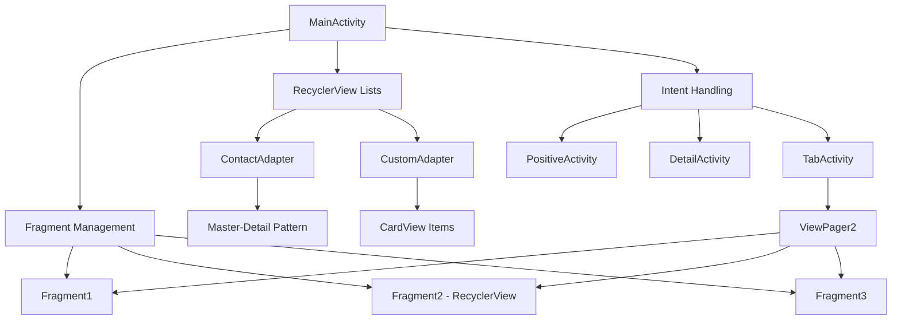

# 📱 Android Learning Application

<div align="center">


**Una collezione completa di esercizi Android per imparare lo sviluppo mobile**

[📖 Documentazione](#-documentazione) • [🚀 Iniziare](#-iniziare) • [✨ Features](#-features) • [📸 Screenshots](#-screenshots) • [🤝 Contribuire](#-contribuire)

</div>

---

## 📋 Indice

- [📱 Panoramica](#-panoramica)
- [✨ Features](#-features)
- [🏗️ Architettura](#️-architettura)
- [🚀 Iniziare](#-iniziare)
- [📚 Esercizi Implementati](#-esercizi-implementati)
- [📸 Screenshots](#-screenshots)
- [🛠️ Tecnologie Utilizzate](#️-tecnologie-utilizzate)
- [📖 Documentazione](#-documentazione)
- [🤝 Contribuire](#-contribuire)
- [📄 Licenza](#-licenza)

---

## 📱 Panoramica

Questa applicazione è un **progetto educativo completo** che raccoglie numerosi esercizi pratici per imparare lo sviluppo Android con Kotlin. Ogni esercizio è implementato seguendo le best practices di Android e Material Design.

### 🎯 Obiettivi del Progetto

- 📚 **Apprendimento pratico** di tutti i componenti fondamentali di Android
- 🎨 **UI/UX moderna** con Material Design 3
- 🔄 **Gestione del lifecycle** delle Activity
- 📱 **Layout responsive** con supporto portrait/landscape
- 💾 **Persistenza dati** e gestione dello stato
- 🌐 **Intent e comunicazione** tra componenti

---

## ✨ Features

<details open>
<summary><b>🎨 Interfaccia Utente</b></summary>

- ✅ Material Design 3 components
- ✅ Dark/Light theme switching
- ✅ Responsive layouts (portrait/landscape)
- ✅ Custom adapters e ViewHolders
- ✅ RecyclerView con CardView
- ✅ Fragment navigation con ViewPager2
- ✅ Menu contestuali e overflow menu

</details>

<details>
<summary><b>📊 Gestione Dati</b></summary>

- ✅ ListView con ArrayAdapter
- ✅ Spinner e AutoCompleteTextView
- ✅ RecyclerView con custom adapter
- ✅ Master-Detail pattern
- ✅ Data classes Kotlin
- ✅ Multiple choice lists

</details>

<details>
<summary><b>🔔 Interazioni</b></summary>

- ✅ AlertDialog customizzati
- ✅ Toast messages
- ✅ CheckBox e RadioButton groups
- ✅ Switch e SwitchMaterial
- ✅ TextWatcher per validazione form
- ✅ Item click listeners

</details>

<details>
<summary><b>📱 Intent e Comunicazione</b></summary>

- ✅ Intent espliciti tra Activity
- ✅ Intent impliciti (EMAIL, SMS, WEB, PHONE)
- ✅ Intent filters personalizzati
- ✅ Data passing tra Activity
- ✅ SmsManager per invio SMS diretto
- ✅ ACTION_SENDTO e ACTION_VIEW

</details>

<details>
<summary><b>🎭 Fragment & Navigation</b></summary>

- ✅ TabLayout con ViewPager2
- ✅ Fragment lifecycle management
- ✅ Dynamic fragment transactions
- ✅ RecyclerView nei Fragment
- ✅ Communication tra Fragment

</details>

---

## 🏗️ Architettura



### 📁 Struttura del Progetto

```
app/
├── src/main/
│   ├── java/com/example/application1/
│   │   ├── MainActivity.kt           # Activity principale con tutti gli esercizi
│   │   ├── PositiveActivity.kt       # Activity secondaria per intent
│   │   ├── DetailActivity.kt         # Detail view per master-detail
│   │   ├── TabActivity.kt            # Gestione tab navigation
│   │   ├── Fragment1.kt              # Primo fragment
│   │   ├── Fragment2.kt              # Fragment con RecyclerView
│   │   ├── Fragment3.kt              # Terzo fragment
│   │   ├── ContactAdapter.kt         # Adapter per rubrica
│   │   ├── CustomAdapter.kt          # Adapter per CardView
│   │   ├── MyPagerAdapter.kt         # Adapter per ViewPager2
│   │   └── ItemViewModel.kt          # Data class
│   ├── res/
│   │   ├── layout/
│   │   │   ├── activity_main.xml     # Layout principale (portrait)
│   │   │   ├── activity_main.xml (land) # Layout landscape
│   │   │   ├── activity_detail.xml   # Layout dettaglio contatto
│   │   │   ├── activity_tab.xml      # Layout per tab
│   │   │   ├── item_contact.xml      # Item layout rubrica
│   │   │   ├── card_view_design.xml  # Card layout
│   │   │   └── fragment_*.xml        # Layout fragments
│   │   ├── menu/
│   │   │   └── main_menu.xml         # Overflow menu
│   │   ├── values/
│   │   │   ├── strings.xml           # String resources
│   │   │   ├── colors.xml            # Color palette
│   │   │   └── themes.xml            # App themes
│   │   └── values-night/
│   │       └── themes.xml            # Dark theme
│   └── AndroidManifest.xml           # App configuration
```

---

## 🚀 Iniziare

### 📋 Prerequisiti

- Android Studio Hedgehog (2023.1.1) o superiore
- JDK 11 o superiore
- Android SDK API 27 (minimo) - API 36 (target)
- Gradle 8.0+

### 🔧 Installazione

1. **Clone il repository**
```bash
git clone https://github.com/tuousername/android-learning-app.git
cd android-learning-app
```

2. **Apri il progetto in Android Studio**
```bash
studio .
```

3. **Sincronizza Gradle**
   - Android Studio sincronizzerà automaticamente le dipendenze
   - Oppure manualmente: `File → Sync Project with Gradle Files`

4. **Esegui l'app**
   - Collega un dispositivo Android o avvia un emulatore
   - Clicca su Run ▶️ o usa `Shift + F10`

### ⚙️ Configurazione

#### Permessi richiesti

L'app richiede i seguenti permessi (già configurati in AndroidManifest.xml):

```xml
<uses-permission android:name="android.permission.SEND_SMS" />
```

#### Build Variants

- **Debug**: Configurazione per sviluppo con logging attivato
- **Release**: Build ottimizzato per produzione

---

## 📚 Esercizi Implementati

### 1️⃣ **Fondamenti UI**

| Esercizio | Descrizione | Componenti |
|-----------|-------------|------------|
| **TextView & Button** | Aggiornamento dinamico della data | TextView, Button, Date() |
| **CheckBox & Validation** | Abilitazione condizionale bottoni | CheckBox, Button state |
| **RadioButton Groups** | Selezione singola con feedback | RadioGroup, RadioButton |
| **Switch Material** | Cambio tema dinamico | SwitchMaterial, colors |
| **EditText Input Types** | Form con validazione | EditText, InputType, TextWatcher |

### 2️⃣ **Layout Avanzati**

| Esercizio | Descrizione | Tecnologie |
|-----------|-------------|------------|
| **LinearLayout Dynamic** | Layout con orientamento dinamico | LinearLayout, weights |
| **RelativeLayout** | Posizionamento relativo elementi | RelativeLayout rules |
| **TableLayout** | Tabella con spanning | TableLayout, TableRow |
| **HorizontalScrollView** | Scroll orizzontale bottoni | HorizontalScrollView |
| **Master-Detail** | Pattern responsive portrait/landscape | layout-land qualifier |

### 3️⃣ **Liste e Adattatori**

| Esercizio | Descrizione | Componenti |
|-----------|-------------|------------|
| **ListView Simple** | Lista ingredienti pizza | ListView, ArrayAdapter |
| **ListView Multiple Choice** | Lista spesa con checkbox | choiceMode="multipleChoice" |
| **Spinner** | Dropdown città | Spinner, AdapterView |
| **AutoCompleteTextView** | Ricerca province | AutoCompleteTextView |
| **RecyclerView Basic** | Lista contatti scrollabile | RecyclerView, ViewHolder |
| **RecyclerView + CardView** | Cards con elevation | CardView, custom adapter |

### 4️⃣ **Dialog e Navigazione**

| Esercizio | Descrizione | Implementazione |
|-----------|-------------|-----------------|
| **AlertDialog** | Conferma azioni utente | AlertDialog.Builder |
| **Custom Dialog** | Dialog con input fields | setView() custom |
| **Intent Esplicito** | Navigazione tra Activity | Intent(context, Activity) |
| **Intent Implicito Email** | Composizione email | ACTION_SEND |
| **Intent Implicito Web** | Apertura browser | ACTION_VIEW + Uri |
| **Intent Implicito Phone** | Avvio dialer | ACTION_DIAL + tel: |

### 5️⃣ **SMS e Comunicazione**

| Esercizio | Descrizione | API utilizzate |
|-----------|-------------|----------------|
| **ACTION_SENDTO SMS** | Apertura app messaggi | ACTION_SENDTO + smsto: |
| **ACTION_VIEW SMS** | Intent SMS generico | ACTION_VIEW + sms: |
| **SmsManager** | Invio SMS diretto | SmsManager.sendTextMessage() |
| **SMS Intent Filter** | App come gestore SMS | intent-filter in manifest |
| **Permission Handling** | Runtime permissions | ActivityCompat.requestPermissions |

### 6️⃣ **Fragment e Tab**

| Esercizio | Descrizione | Componenti |
|-----------|-------------|------------|
| **TabLayout** | Navigazione a tab | TabLayout + ViewPager2 |
| **Fragment Lifecycle** | Gestione ciclo vita | onCreate, onCreateView |
| **ViewPager2** | Swipe tra pagine | FragmentStateAdapter |
| **Fragment Communication** | Passaggio dati | Bundle arguments |
| **RecyclerView in Fragment** | Liste nei fragment | Fragment + RecyclerView |

### 7️⃣ **Temi e Styling**

| Esercizio | Descrizione | Risorse |
|-----------|-------------|---------|
| **Day/Night Theme** | Tema chiaro/scuro | values-night/ |
| **Dynamic Theme Switch** | Cambio tema runtime | AppCompatDelegate.setDefaultNightMode() |
| **Material Colors** | Color palette custom | colors.xml |
| **Typography** | DP vs SP units | textSize, layout dimensions |
| **Responsive Design** | Layout portrait/landscape | layout-land/ |

---

## 📸 Screenshots

<div align="center">

### 📱 Portrait Mode

| Main Screen | ListView | RecyclerView |
|-------------|----------|--------------|
|  |  |  |


| ButtonTest | Tab Navigation | Dark Theme |
|---------------|----------------|------------|
|  |  |  |

### 🌄 Landscape Mode
||


</div>

---

## 🛠️ Tecnologie Utilizzate

### 🎯 Core


### 📚 Libraries

| Library | Version | Scopo |
|---------|---------|-------|
| **AndroidX Core KTX** | Latest | Kotlin extensions |
| **AppCompat** | Latest | Backward compatibility |
| **Material Components** | Latest | Material Design 3 |
| **ConstraintLayout** | Latest | Layout flessibili |
| **RecyclerView** | Latest | Liste performanti |
| **CardView** | Latest | Card UI pattern |
| **ViewPager2** | Latest | Swipeable views |
| **Fragment** | Latest | Modular UI |

### 🎨 Design

- **Material Design 3** - Design system moderno
- **Android Green** (#3DDC84) - Colore primario
- **Orange** (#FF7518) - Colore secondario
- **Dark Theme** - Supporto completo tema scuro

---

## 📖 Documentazione

### 🔄 Lifecycle Management

L'app implementa il logging completo del lifecycle delle Activity:

```kotlin
override fun onCreate(savedInstanceState: Bundle?) {
    super.onCreate(savedInstanceState)
    Log.d(TAG, "onCreate() called")
    // Setup UI
}

override fun onResume() {
    super.onResume()
    Log.d(TAG, "onResume() called")
}

// ... altri metodi lifecycle
```

### 🎨 Theme Switching

Cambio dinamico tra tema chiaro e scuro:

```kotlin
val currentMode = resources.configuration.uiMode and Configuration.UI_MODE_NIGHT_MASK
if (currentMode == Configuration.UI_MODE_NIGHT_YES) {
    AppCompatDelegate.setDefaultNightMode(AppCompatDelegate.MODE_NIGHT_NO)
} else {
    AppCompatDelegate.setDefaultNightMode(AppCompatDelegate.MODE_NIGHT_YES)
}
```

### 📱 Master-Detail Pattern

Layout responsive con configurazione diversa per portrait/landscape:

**Portrait**: `layout/activity_main.xml` - ListView che apre DetailActivity

**Landscape**: `layout-land/activity_main.xml` - ListView + pannello dettagli affiancati

```kotlin
val testoNomeLandscape = findViewById<TextView>(R.id.det_nome)

if (testoNomeLandscape != null) {
    // Landscape: aggiorna pannello destro
    updateDetailPanel(contatto)
} else {
    // Portrait: apri nuova Activity
    startActivity(Intent(this, DetailActivity::class.java))
}
```

### 🔐 Permission Handling

Gestione runtime permissions per invio SMS:

```kotlin
if (ContextCompat.checkSelfPermission(this, Manifest.permission.SEND_SMS)
    != PackageManager.PERMISSION_GRANTED) {
    ActivityCompat.requestPermissions(this, 
        arrayOf(Manifest.permission.SEND_SMS), 
        REQUEST_CODE)
} else {
    sendSms()
}
```

---

## 🤝 Contribuire

I contributi sono benvenuti! Ecco come puoi aiutare:

### 🐛 Segnalare Bug

Apri una [issue](https://github.com/tuousername/android-learning-app/issues) con:
- Descrizione del bug
- Passi per riprodurlo
- Comportamento atteso vs attuale
- Screenshot (se applicabile)
- Device e versione Android

### ✨ Proporre Feature

1. Fork il progetto
2. Crea un branch (`git checkout -b feature/AmazingFeature`)
3. Commit le modifiche (`git commit -m 'Add some AmazingFeature'`)
4. Push al branch (`git push origin feature/AmazingFeature`)
5. Apri una Pull Request

### 📝 Guidelines

- Segui lo stile Kotlin esistente
- Commenta il codice complesso
- Aggiungi test se possibile
- Aggiorna la documentazione

---

## 📄 Licenza

Questo progetto è distribuito sotto licenza MIT. Vedi il file [LICENSE](LICENSE) per i dettagli.

```
MIT License

Copyright (c) 2024 [Tuo Nome]

Permission is hereby granted, free of charge, to any person obtaining a copy
of this software and associated documentation files (the "Software"), to deal
in the Software without restriction...
```

---

## 👨‍💻 Autore

**[Tuo Nome]**

- 🌐 Website: [yourwebsite.com](https://yourwebsite.com)
- 📧 Email: your.email@example.com
- 💼 LinkedIn: [Your Profile](https://linkedin.com/in/yourprofile)
- 🐙 GitHub: [@yourusername](https://github.com/yourusername)

---

## 🙏 Ringraziamenti

- [Android Developers](https://developer.android.com) - Documentazione ufficiale
- [Material Design](https://material.io) - Design guidelines
- [Kotlin Documentation](https://kotlinlang.org/docs) - Linguaggio Kotlin
- Università del Piemonte Orientale - Corso di sviluppo Android

---

## 📊 Statistiche Progetto


---

<div align="center">

### ⭐ Se questo progetto ti è stato utile, lascia una stella!

Made with ❤️ and ☕ by [Your Name]

[⬆ Torna su](#-android-learning-application)

</div>

---

## 🔜 Roadmap

- [ ] Implementazione database Room
- [ ] ViewModel e LiveData
- [ ] Retrofit per networking
- [ ] Coroutines per operazioni asincrone
- [ ] Unit e UI testing
- [ ] CI/CD con GitHub Actions
- [ ] Compose UI migration

---

Questo README fornisce una panoramica completa del progetto. Per domande o supporto, apri una [issue](https://github.com/yourusername/android-learning-app/issues) o contattami direttamente.
